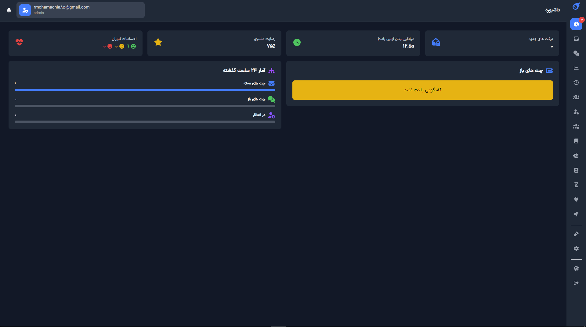
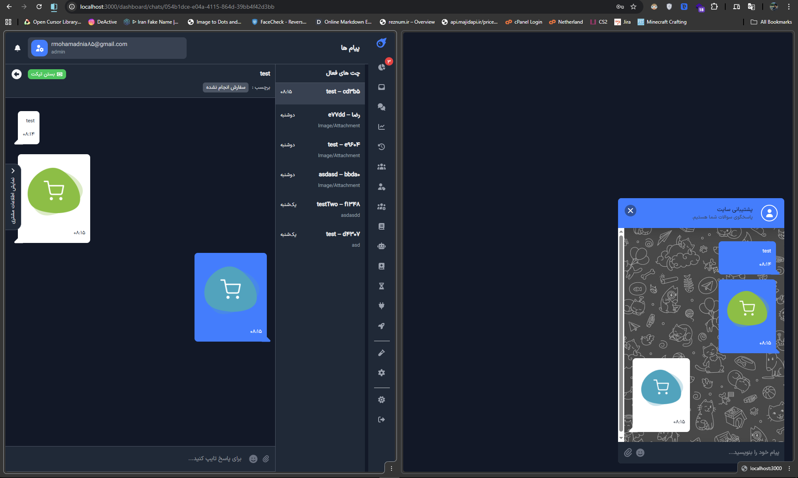

# 🚀 Support Chat System

Modern **real-time live chat & support ticket system** with admin dashboard


**Full RTL + Persian support** • **Dark/Light theme** • **Docker-ready**

## ✨ Features

- 🛡️ Two-step login (email + OTP)
- 💬 Real-time chat (Socket.IO) with typing indicator & seen status
- 📎 File upload/download in chat (images, pdf, etc.)
- ⭐ Chat rating after close (1–5 stars + optional comment)
- 📊 Live & historical statistics (average response time, satisfaction, chat count, ...)
- 👥 Admin dashboard with:
  - List of open / closed chats
  - Customer info sidebar
  - Live chat joining & multiple tabs support
- 🔒 IP-based banning & rate limiting (Redis)
- ♾️ Infinite scroll for messages & chat list
- 🧩 Guest chat widget (embeddable)
- 📧 OTP & notification emails via Celery + Gmail
- 🌙 Persistent dark/light mode
- 🖥️ Fully responsive + beautiful Persian font (IRANSansX all weights)

## 📸 Screenshots

### 1. Admin Dashboard – Overview & Statistics


### 2. Live Chat Room (Agent view)


## 🛠 Tech Stack

**Backend**
- FastAPI (ASGI)
- SQLAlchemy 2.0 + asyncpg
- Alembic migrations
- python-socketio
- Redis (cache, rate-limit, session, pub/sub)
- Celery + Redis broker (email tasks)
- Pydantic v2

**Frontend** (Next.js 14+ App Router)
- React 18 + Server Components
- Tailwind CSS
- TanStack Query (infinite queries + optimistic updates)
- Zustand (UI state: theme, sidebar, etc.)
- socket.io-client
- IRANSansX font family

## 📂 Project Structure

```
SupportChatSystem/
├── .github/workflows/docker.yml
├── alembic/                   # migrations (9 revisions already)
├── app/
│   ├── api/routes/            # auth.py, chat_http.py, users.py
│   ├── core/                  # config, db, redis, security
│   ├── middleware/            # ip_ban
│   ├── models/                # chat, otp, user
│   ├── realtime/              # chat_events, rate_limit, socketio_server
│   ├── schemas/
│   ├── services/              # chat_service, gmail_service, otp_*
│   ├── tasks/                 # celery + email tasks
│   └── main.py
├── frontend/
│   ├── app/                   # dashboard, login, home, chats/[roomId]
│   ├── components/            # ~45 components (ChatWidget, MessageBox, SideBar, ...)
│   ├── hooks/                 # useMessageInfiniteQuery, useRoomInfoQuery, ...
│   ├── store/                 # uiStore (zustand)
│   ├── public/fonts/IRANSansX/
│   └── utils/                 # api, socket, validation, ...
├── screenshots/
│   ├── chat.png
│   └── dashboard.png
├── docker-compose.yml
├── Dockerfile                 # multi-stage for frontend & backend
├── .env.example
└── requirements.txt
```

## 🚀 Quick Start – Docker (Recommended)

```bash
git clone https://github.com/ItsReZNuM/SupportChatSystem.git
cd SupportChatSystem

cp .env.example .env

docker compose up -d --build
```

- After Cloning
- Admin Panel → http://localhost:3000/dashboard
- Guest Button → http://localhost:8000/home
- API Document → http://localhost:8000/docs

## 🛠 Development Mode (Manual)

### Backend
```bash
python -m venv venv
source venv/bin/activate
pip install -r requirements.txt
alembic upgrade head
uvicorn app.main:app --reload --port 8000

celery -A app.tasks.celery_app worker --loglevel=info
```

### Frontend
```bash
cd frontend
npm i
npm run dev
```

## 🔑 Important .env Keys

```env
# Database
DATABASE_URL=postgresql+asyncpg://postgres:yourpass@db:5432/supportchat

# Redis
REDIS_URL=redis://redis:6379/0

# JWT
SECRET_KEY=change-this-to-very-long-random-string
ALGORITHM=HS256

# Email
GMAIL_USER=your@gmail.com
GMAIL_PASSWORD=your-app-specific-password

FRONTEND_URL=http://localhost:3000
```

## 📌 Important

- For Adding Admins , You Should Add them via PostgreSQL Query Tool ( For More Security)

## 📄 License

MIT License

© 2025 – ItsReZNuM & hasanmir1999

### Made With ♥ By Developement Team